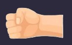

# Rock-Paper-Scissor Game

A simple and interactive Rock-Paper-Scissor game built with HTML, CSS, and JavaScript. Challenge the computer and see if you can beat its moves!

## Demo



## Features

- Play Rock, Paper, or Scissors against the computer.
- Real-time score tracking for both player and computer.
- Visual representation of each move with images.
- Responsive and user-friendly interface.

## How to Play

1. **Start the Game:**  
   Open `index.html` in your browser.

2. **Choose Your Move:**  
   Click on one of the three buttons: **STONE**, **PAPER**, or **SCISSORS**.

3. **View Results:**  
   The computer will randomly select its move. Both moves are displayed with images, and the winner of the round is shown.

4. **Score Tracking:**  
   The scores for both the player and the computer are updated after each round.

## Project Structure

```
.
├── index.html
├── style.css
├── script.js
├── rockPlayer.jpg
├── rockComputer.jpg
├── paperPlayer.jpg
├── paperComputer.jpg
├── scissorPlayer.jpg
├── scissorComputer.jpg
```

- `index.html` - Main HTML file for the game.
- `style.css` - Stylesheet for the game.
- `script.js` - JavaScript logic for game functionality.
- Image files - Visuals for each move (player and computer).

## Installation & Usage

1. **Clone the repository:**
   ```powershell
   git clone https://github.com/Rpaul05/Rock-Paper-Scissor-Game.git
   ```

2. **Navigate to the project directory:**
   ```powershell
   cd Rock-Paper-Scissor-Game
   ```

3. **Open `index.html` in your browser.**

No additional dependencies are required.

## Contributing

Contributions are welcome! Please fork the repository and submit a pull request.

## Author

- GitHub: [Rpaul05](https://github.com/Rpaul05)

## License

This project is licensed under the MIT License.

---

> **Repository:**  
> [https://github.com/Rpaul05/Rock-Paper-Scissor-Game](https://github.com/Rpaul05/Rock-Paper-Scissor-Game)
